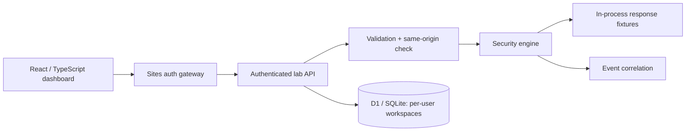

# Guardrail

**Test access controls. Investigate the signal. Prove the fix.**

Guardrail is a full-stack security engineering portfolio project by Aarav Rego. It combines an isolated ticket-access sandbox, reproducible security checks, rule-based event correlation, and persistent evidence in a React dashboard.

> This is a synthetic teaching lab, not a live vulnerability scanner or production SIEM. Baseline responses are evaluated in-process; no vulnerable endpoint is exposed. Profile selection does not weaken the deployed app.

## What works

- **Three executable security checks:** ticket ownership (owner / foreign user / admin / anonymous), selected HTTP response headers, and session cookie attributes.
- **Two detection rules:** three access denials or five failed logins by the same synthetic actor within 60 seconds, with supporting event IDs.
- **Ticket sandbox:** create synthetic tickets and attempt reads as Alice, Bob, or an administrator. The server enforces the selected actor's access policy; denied reads never return ticket content.
- **Evidence workflow:** baseline/hardened runs, before-and-after comparison, findings with remediation, event timeline, and downloadable JSON reports.
- **Persistence and isolation:** Cloudflare D1 / SQLite stores each authenticated platform user's workspace separately; conditional revisions prevent lost concurrent updates.
- **Regression tests:** authorization matrix, denied-response privacy, header/cookie edge cases, detection thresholds and windows, input validation, evidence limits, and database isolation.

## Run locally

Requires **Node.js 24+** and npm. No external database or API key is required for development.

```sh
git clone https://github.com/mieklitoris/guardrail.git
cd guardrail
npm ci
npm run db:local
npm run dev
```

Open the local URL printed by the development server (normally `http://localhost:5173`). The supplied development integration injects a fixed **local-only mock platform identity**. It is not a real login and is never an acceptable production auth service. The hosted app uses the Sites gateway and ChatGPT sign-in.

```sh
npm test
npm run typecheck
npm run build
```

The build targets a Cloudflare Worker through Vinext. This is not a static GitHub Pages application. The repository includes the reproducible source and CI checks; production hosting is separate from GitHub.

## Five-minute walkthrough

1. Click **Run investigation**. The insecure fixture allows Alice to read Bob's synthetic ticket. Three subsequent attempts against the secure policy are denied.
2. Open **Activity & alerts** and inspect **Repeated access denials**. Each alert links to its evidence events.
3. Open **Findings & fixes** and inspect **Ticket ownership enforcement**. Read the observed status codes and remediation.
4. Click **Verify hardened fixture**. The same three checks now pass; compare baseline and hardened results.
5. In **Security lab → Ticket sandbox**, attempt Bob's ticket as Alice (403), Bob (200), and Morgan/admin (200).
6. Export the JSON evidence report. It includes timestamps, results, alerts, and synthetic events—not real credentials.

## Architecture



| Component       | Location                   | Responsibility                                           |
| --------------- | -------------------------- | -------------------------------------------------------- |
| Dashboard       | `app/page.tsx`             | Investigation, tickets, findings, and event views        |
| Server boundary | `app/api/lab/route.ts`     | Identity, input checks, workspace isolation, persistence |
| Security engine | `lib/security/engine.ts`   | Authorization, fixtures, checks, detections              |
| Database        | `db/schema.ts`, `drizzle/` | Schema and immutable migrations                          |
| Tests           | `tests/`                   | Security invariants and SQLite behavior                  |

## Security model and limits

The **platform user** is the real authentication boundary. Alice, Bob, and Morgan are synthetic principals inside that user's private lab. Choosing an actor deliberately simulates a session; it is not evidence of password authentication or a production role-assignment system.

The GET API returns a directory of synthetic ticket IDs/owners/statuses. Ticket titles are returned only after an allowed read or creation. The owner-scoped SQL boundary protects real workspaces; the persona policy illustrates object-level authorization within one lab.

All activity is generated in the lab. Failed logins do not submit passwords. The checks inspect synthetic `Response` objects, not this deployed website or an external host. No URL-fetch feature exists, so the app has no arbitrary outbound scanner or associated SSRF surface.

Saved history is capped at 40 runs and 500 events per workspace, and tickets at 100. Alerts are reconstructed from retained events. Actions are throttled to one per 800 ms per workspace. This is a demo throttle, not comprehensive abuse protection.

Read [the threat model](docs/THREAT_MODEL.md), [detection specification](docs/DETECTIONS.md), and [project walkthrough](docs/DEMO.md).

## Why this project

- **Software engineering:** typed full-stack code, persistent data, API validation, concurrency control, CI.
- **Application security / penetration testing:** object-level authorization, reproducible evidence, remediation, regression checks.
- **SOC / detection engineering:** event schemas, time-window correlation, evidence triage, false-positive analysis.

## Next steps

A separate authenticated target application, an allowlisted live-check worker, deploy-time header verification, richer detection grouping, and end-to-end gateway tests would extend the project. They are not implemented or claimed here.

## References

- [OWASP Authorization Testing](https://owasp.org/www-project-web-security-testing-guide/stable/4-Web_Application_Security_Testing/05-Authorization_Testing/02-Testing_for_Bypassing_Authorization_Schema)
- [OWASP Secure Headers](https://owasp.org/projects/secure-headers-project)
- [OWASP Session Management](https://cheatsheetseries.owasp.org/cheatsheets/Session_Management_Cheat_Sheet.html)
